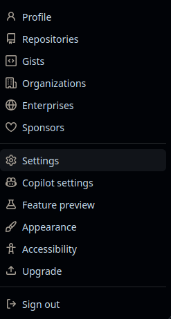
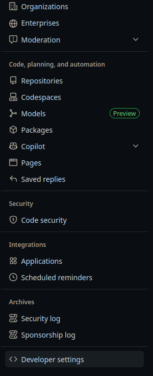
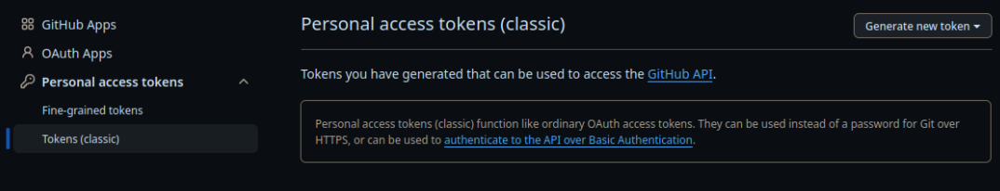
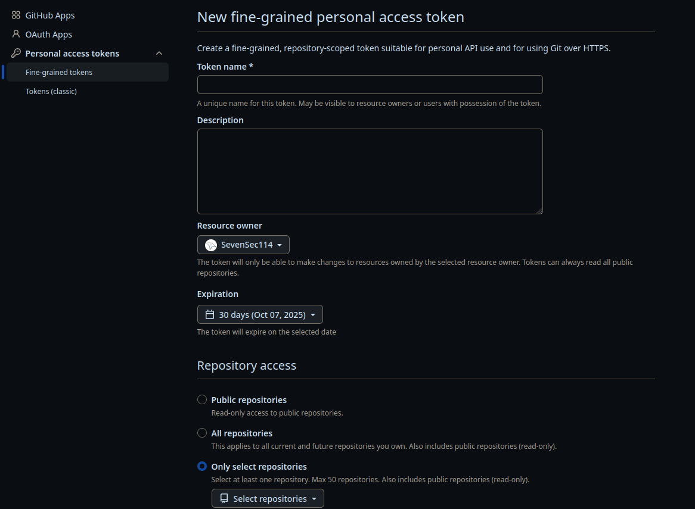
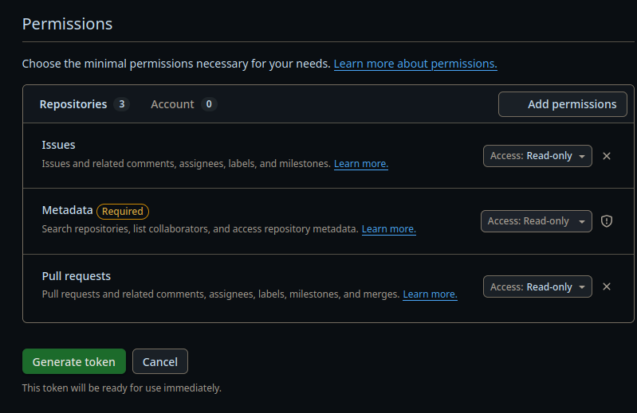

## Github Token Generation Guild
1. Click your profile picture → **Settings**.

2. Scroll down the left sidebar → **Developer settings** → **Personal access tokens**.

3. Choose **Fine-grained tokens** (recommended) or **Tokens (classic)** → **Generate new token**.

1. Fill in:
   - **Token name**
   - **Expiration date**  (No expiration is better for you if you would not need to update the token frequently)
   - **Repository access** (select specific repos, or all repos)
   - **Permissions** (e.g., `Contents: Read and write`)
     

2. Click **Generate token** → **Copy and store it securely** (it will only be shown once).
